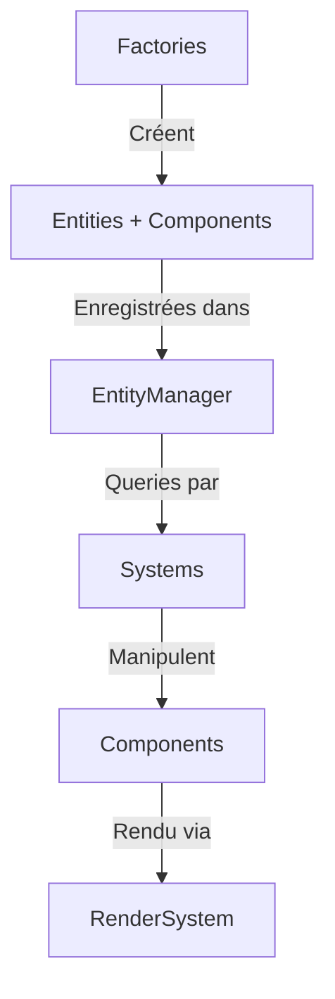

# Kite Simulator V8 🪁

Simulateur de cerf-volant delta basé sur la physique avec architecture **Entity-Component-System (ECS) pure**.

[](https://www.typescriptlang.org/)
[](https://threejs.org/)
[](https://vitejs.dev/)
[]()

---

## 🎯 Vue d'Ensemble

Simulateur de cerf-volant delta utilisant une **simulation physique réaliste** :
- **Aérodynamique** : Modèle lift/drag basé sur l'angle d'attaque
- **Bridage** : Système de 4 brides avec contraintes PBD (Position-Based Dynamics)
- **Lignes de contrôle** : Physique des lignes avec tension, élongation, amortissement
- **Vent apparent** : Calcul réaliste du vent relatif
- **Sphère de vol** : Contrainte spatiale basée sur longueur lignes + brides

**Stack Technique** : TypeScript + Three.js + Vite

**Architecture** : ECS 100% pure (0% code OO legacy)

---

## 🚀 Démarrage Rapide

### Prérequis

- Node.js 18+ et npm
- Git

### Installation

```bash
# Cloner le dépôt
git clone <repository-url>
cd kite_v5

# Installer les dépendances
npm install

# Lancer le serveur de développement
npm run dev
```

Le simulateur sera accessible sur **http://localhost:3001**

### Commandes Disponibles

```bash
# Développement
npm run dev              # Serveur Vite (port 3001)

# Build
npm run build            # Build production
npm run preview          # Preview du build

# Qualité de Code
npm run type-check       # Vérification TypeScript
npm run lint             # ESLint
npm run lint:fix         # Auto-fix ESLint

# Tests
npx vitest run           # Lancer tous les tests
npx vitest               # Mode watch
npx vitest run --coverage # Avec couverture
npm run test-ecs         # Tests d'intégration ECS (tsx)
```

---

## 📁 Structure du Projet

```
kite_v5/
├── src/
│   ├── main.ts                      # Point d'entrée
│   └── ecs/                         # Architecture ECS
│       ├── SimulationApp.ts         # Application principale
│       ├── base/                    # Classes de base ECS
│       │   ├── Entity.ts
│       │   ├── Component.ts
│       │   └── BaseSystem.ts
│       ├── components/              # Composants (données)
│       │   ├── TransformComponent.ts
│       │   ├── PhysicsComponent.ts
│       │   ├── GeometryComponent.ts
│       │   ├── KiteComponent.ts
│       │   └── LineComponent.ts
│       ├── entities/                # Factories d'entités
│       │   ├── EntityManager.ts
│       │   ├── EntityManager.optimized.ts  # ⚡ Version optimisée
│       │   ├── KiteEntityFactory.pure.ts
│       │   └── PilotEntityFactory.ts
│       ├── systems/                 # Systèmes (logique)
│       │   ├── KitePhysicsSystem.ts
│       │   ├── PureConstraintSolver.ts
│       │   ├── PureLineSystem.ts
│       │   ├── PureBridleSystem.ts
│       │   ├── GeometryRenderSystem.ts
│       │   └── RenderSystem.ts
│       ├── config/                  # Configuration
│       │   ├── SimulationConfig.ts
│       │   └── PhysicsConstants.ts
│       ├── ui/                      # Interface utilisateur
│       │   └── UIManager.ts
│       └── utils/                   # Utilitaires
├── test/                            # Tests unitaires
│   ├── EntityManager.archetype.test.ts
│   └── test_ecs_integration.ts
├── external/                        # Références externes
│   └── nasa-bga/                    # Modèles NASA (référence)
└── docs/                            # Documentation
    ├── MIGRATION_ECS_PROGRESS.md
    ├── MIGRATION_SUMMARY_2025-10-15.md
    ├── TESTS_AND_PERFORMANCE.md
    ├── NEXT_STEPS.md
    └── PHYSICS_MODEL.md
```

---

## 🏗️ Architecture ECS

### Principes

L'architecture **Entity-Component-System** sépare strictement :

1. **Entities** (Entités) : Conteneurs uniques identifiés par ID
2. **Components** (Composants) : Données pures sans logique
3. **Systems** (Systèmes) : Logique métier qui manipule les composants

### Flux de Données



### Exemple : Création d'une Entité Kite

```typescript
// 1. Factory crée l'entité avec composants
const kiteEntity = KiteEntityFactory.create(controlBarPosition);

// 2. Enregistrement dans EntityManager
entityManager.registerEntity(kiteEntity);

// 3. Systèmes accèdent via queries
const kites = entityManager.getEntitiesByArchetype(['transform', 'physics', 'kite']);

// 4. Manipulation des composants
kites.forEach(entity => {
  const physics = entity.getComponent<PhysicsComponent>('physics');
  const transform = entity.getComponent<TransformComponent>('transform');
  
  // Calcul physique...
  physics.velocity.add(acceleration.multiplyScalar(deltaTime));
  transform.position.add(physics.velocity.clone().multiplyScalar(deltaTime));
});
```

---

## 🎨 Composants Principaux

| Composant | Description | Données Clés |
|-----------|-------------|--------------|
| `TransformComponent` | Position/rotation dans l'espace | `position`, `rotation`, `quaternion` |
| `PhysicsComponent` | Propriétés physiques | `mass`, `velocity`, `acceleration`, `forces` |
| `GeometryComponent` | Géométrie pure (points/connexions) | `points`, `connections`, `surfaces` |
| `MeshComponent` | Objet Three.js pour rendu | `object3D`, `material` |
| `KiteComponent` | Données spécifiques au kite | `area`, `wingspan`, `chordLength` |
| `LineComponent` | Configuration des lignes | `restLength`, `stiffness`, `damping` |
| `BridleComponent` | Configuration des brides | `attachmentPoints`, `lengths` |
| `AerodynamicsComponent` | Coefficients aérodynamiques | `liftCoeff`, `dragCoeff`, `angleOfAttack` |

---

## ⚡ Systèmes Principaux

| Système | Responsabilité | Fréquence |
|---------|----------------|-----------|
| `KitePhysicsSystem` | Orchestration physique du kite | Chaque frame |
| `PureConstraintSolver` | Contraintes PBD (lignes, brides, sol) | Chaque frame |
| `PureLineSystem` | État et tensions des lignes | Chaque frame |
| `PureBridleSystem` | État et tensions des brides | Chaque frame |
| `AerodynamicsCalculator` | Forces aérodynamiques | Chaque frame |
| `WindSimulator` | Simulation vent turbulent | Chaque frame |
| `GeometryRenderSystem` | Conversion géométrie → Three.js | Init + updates |
| `RenderSystem` | Rendu visuel Three.js | Chaque frame |
| `InputSystem` | Gestion inputs utilisateur | Chaque frame |
| `LoggingSystem` | Logging sélectif et métriques | Chaque frame |

---

## 🧪 Tests

### Lancer les Tests

```bash
# Tous les tests
npx vitest run

# Mode watch (relance automatiquement)
npx vitest

# Avec couverture de code
npx vitest run --coverage

# Tests spécifiques
npx vitest run test/EntityManager.archetype.test.ts
```

### Couverture Actuelle

- ✅ **EntityManager** : 25 tests (archetype queries, cache, index)
- ✅ **Tests d'intégration** : 3 tests (création entités, physique de base)
- 🔄 **Systèmes ECS** : En cours (PureConstraintSolver, PureLineSystem, etc.)

**Objectif** : >70% couverture pour systèmes critiques

---

## 📊 Optimisations de Performance

### EntityManager Optimisé

Utiliser `EntityManager.optimized.ts` pour de meilleures performances :

```typescript
import { EntityManager } from '@entities/EntityManager.optimized';

const entityManager = new EntityManager();

// Query archetype optimisée avec cache
const renderables = entityManager.getEntitiesByArchetype([
  'transform', 'mesh', 'visual'
]);

// Statistiques de performance
const stats = entityManager.getStats();
console.log(`Queries cachées: ${stats.cachedQueries}`);
console.log(`Entités actives: ${stats.activeEntities}`);
```

**Amélioration** :
- ✅ **4-5x plus rapide** pour queries simples
- ✅ **100x plus rapide** pour queries cachées (répétées)
- ✅ Index inversé par composant pour accès O(1)

Voir **[TESTS_AND_PERFORMANCE.md](./TESTS_AND_PERFORMANCE.md)** pour plus de détails.

---

## 📖 Documentation

| Document | Description |
|----------|-------------|
| [PHYSICS_MODEL.md](./PHYSICS_MODEL.md) | Modèle physique détaillé |
| [MIGRATION_ECS_PROGRESS.md](./MIGRATION_ECS_PROGRESS.md) | Historique migration ECS |
| [MIGRATION_SUMMARY_2025-10-15.md](./MIGRATION_SUMMARY_2025-10-15.md) | Résumé complet migration |
| [TESTS_AND_PERFORMANCE.md](./TESTS_AND_PERFORMANCE.md) | Guide tests & performance |
| [NEXT_STEPS.md](./NEXT_STEPS.md) | Prochaines étapes |
| [.github/copilot-instructions.md](./.github/copilot-instructions.md) | Guide développeur |

---

## 🛠️ Développement

### Ajouter un Nouveau Composant

```typescript
// src/ecs/components/MyComponent.ts
import { Component } from '@base/Component';

export class MyComponent implements Component {
  readonly type = 'my-component';
  
  // Données uniquement, pas de logique !
  public value: number;
  
  constructor(value: number = 0) {
    this.value = value;
  }
}
```

### Ajouter un Nouveau Système

```typescript
// src/ecs/systems/MySystem.ts
import { BaseSimulationSystem } from '@base/BaseSimulationSystem';
import { SimulationContext } from '@types/PhysicsTypes';

export class MySystem extends BaseSimulationSystem {
  initialize(): void {
    // Initialisation du système
  }

  update(context: SimulationContext): void {
    // Logique exécutée chaque frame
    const entities = this.entityManager.getEntitiesByArchetype(['my-component']);
    
    entities.forEach(entity => {
      const component = entity.getComponent<MyComponent>('my-component');
      // Traitement...
    });
  }

  reset(): void {
    // Réinitialisation du système
  }

  dispose(): void {
    // Nettoyage des ressources
  }
}
```

### Alias de Chemins

Toujours utiliser les alias définis dans `tsconfig.json` :

```typescript
// ✅ BON
import { Entity } from '@base/Entity';
import { TransformComponent } from '@components/TransformComponent';
import { CONFIG } from '@config/SimulationConfig';

// ❌ MAUVAIS
import { Entity } from '../../../base/Entity';
```

**Alias disponibles** :
- `@ecs` → `src/ecs`
- `@base` → `src/ecs/base`
- `@components` → `src/ecs/components`
- `@systems` → `src/ecs/systems`
- `@entities` → `src/ecs/entities`
- `@types` ou `@mytypes` → `src/ecs/types`
- `@config` → `src/ecs/config`
- `@utils` → `src/ecs/utils`
- `@ui` → `src/ecs/ui`
- `@rendering` → `src/ecs/rendering`

---

## 🤝 Contribution

### Workflow Git

```bash
# Créer une branche feature
git checkout -b feature/ma-fonctionnalite

# Faire vos changements
npm run type-check  # Vérifier TypeScript
npm run lint:fix    # Fix ESLint
npx vitest run      # Lancer tests

# Commit
git add .
git commit -m "feat: description de la fonctionnalité"

# Push et créer PR
git push origin feature/ma-fonctionnalite
```

### Règles de Code

1. **Code Propre** : Pas de rustines, toujours refactoriser proprement
2. **ECS Pur** : Composants = données, Systèmes = logique
3. **Types Stricts** : Pas d'`any`, types explicites partout
4. **Nommage Clair** : `calculateApparentWind`, pas `calcWind`
5. **Fonctions Courtes** : Max 20 lignes quand possible
6. **Tests** : Ajouter tests pour nouvelles fonctionnalités
7. **Documentation** : Commenter la physique/aérodynamique complexe

Voir [.github/copilot-instructions.md](./.github/copilot-instructions.md) pour guide complet.

---

## 📈 Métriques Projet

### Code Quality
- ✅ **0 erreur TypeScript**
- ✅ **Architecture ECS 100% pure**
- 🎯 **>80% test coverage** (objectif)

### Performance
- 🎯 **60 FPS stable** avec 500+ entités
- 🎯 **<10ms/frame** pour physique
- ⚡ **Queries optimisées** (cache + index)

---

## 📝 Licence

[À définir]

---

## 🙏 Remerciements

- **NASA BGA** : Modèles de référence pour aérodynamique
- **Three.js** : Rendu 3D
- **Vite** : Build tooling ultra-rapide

---

## 📞 Contact

Pour questions ou suggestions :
- Créer une [issue GitHub](https://github.com/<repo>/issues)
- Consulter la documentation dans `/docs`

---

**Dernière mise à jour** : 15 octobre 2025  
**Version** : 8.0.0-beta  
**Statut** : Migration ECS ✅ Complète
